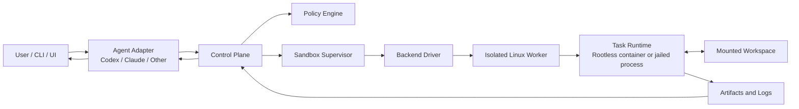
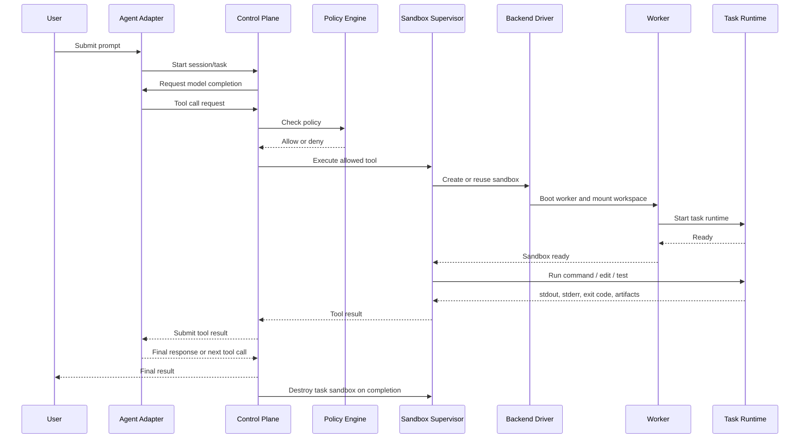
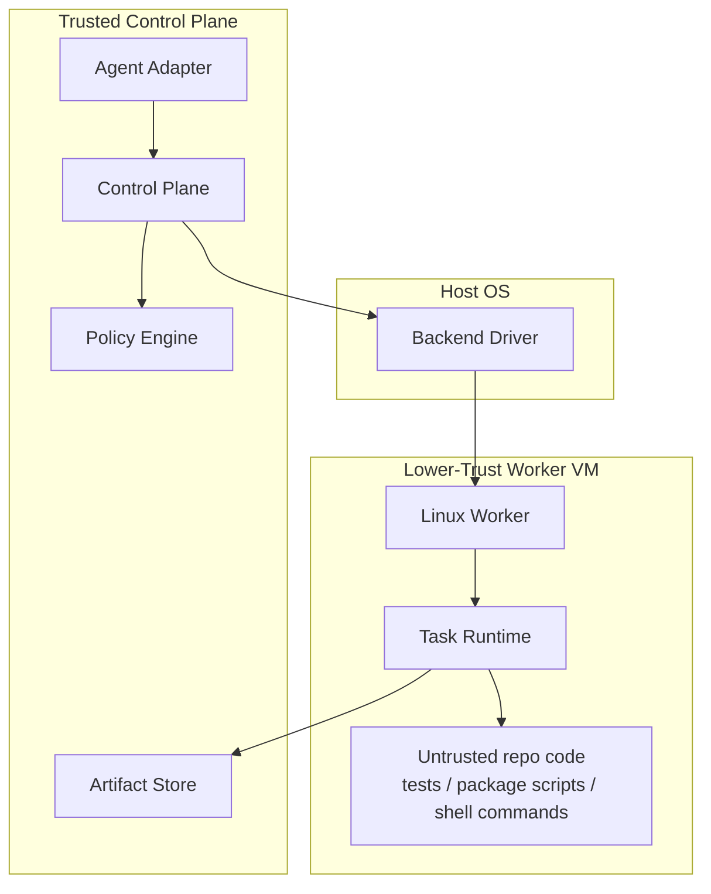
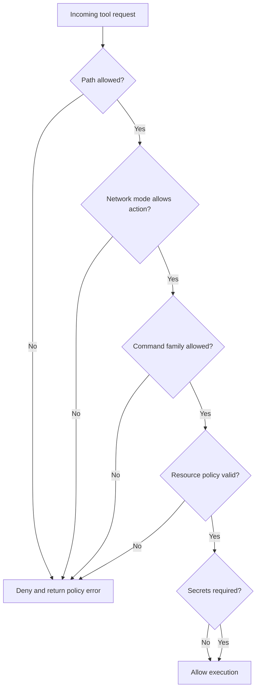
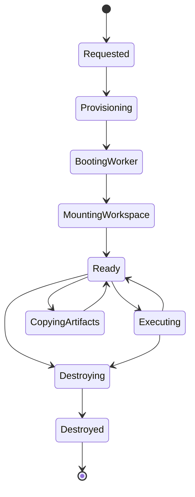

# Agent Sandbox Architecture

## 1. Purpose

This document defines a portable sandbox architecture for running coding agents against a restricted workspace without exposing the host machine. The design supports Linux and macOS hosts, keeps the LLM-facing control plane outside the sandbox, and uses a Linux worker environment as the execution standard.

The main objective is:

- let coding agents inspect, edit, build, and test code
- prevent direct access to arbitrary host files
- restrict network, process, and filesystem scope by policy
- make the execution backend portable across host operating systems

## 2. Goals

- Strong isolation from the host machine
- Common execution model across Linux and macOS
- Support for multiple coding agents such as Codex and Claude Code
- Policy-driven control of filesystem, network, resources, secrets, and lifecycle
- Ephemeral task execution with clean teardown
- Clear backend abstraction so host-specific isolation can vary without changing the control plane

## 3. Non-Goals

- Running the LLM inside the sandbox
- Supporting arbitrary desktop GUI apps in the first version
- Full Windows support in the MVP
- Building a multi-tenant cloud scheduler in the first version
- Replacing package registries, git hosting, or secret managers

## 4. Design Principles

- `Control plane outside, execution inside`
- `VM boundary for host protection`
- `Task boundary inside VM for per-run isolation`
- `Linux guest standardization across host OSes`
- `Deny by default for network and host file access`
- `Ephemeral compute, explicit mounts, explicit policy`

## 5. High-Level Architecture



## 6. Core Execution Model

The system is split into two logical domains:

### 6.1 Control Plane

The control plane:

- receives user prompts and task requests
- talks to the LLM provider
- exposes tools to the coding agent
- decides which sandbox actions are allowed
- provisions and tears down sandbox resources
- records logs, command results, artifacts, and metadata

The control plane is trusted infrastructure. It may have network access to the LLM API and internal storage services.

### 6.2 Execution Plane

The execution plane:

- runs inside a sandboxed Linux worker
- executes shell commands, test runs, file edits, and builds
- only sees mounted paths that were explicitly granted
- does not directly own LLM credentials
- returns command output and file changes back to the control plane

The execution plane is treated as lower trust because it runs generated commands, third-party build tools, and untrusted repository code.

## 7. Platform Strategy

The architecture is host-agnostic at the API level but uses different isolation backends.

### 7.1 Linux Host

Preferred stack:

- `KVM-backed VM or microVM`
- Linux worker guest
- rootless task container inside worker

Optional future backend:

- Firecracker-based microVMs

### 7.2 macOS Host

Preferred stack:

- `Apple Virtualization Framework`
- Linux worker guest
- rootless task container inside worker

### 7.3 Cross-Platform Rule

The control plane does not depend on the host OS. Only the backend driver changes. The worker guest remains Linux so the agent runtime and tools are consistent.

## 8. Detailed Components

## 8.1 Agent Adapter

The agent adapter integrates a provider-specific coding agent with the platform tool model.

Responsibilities:

- convert provider-specific messages to internal task format
- expose a common tool contract to the model
- submit tool results back to the provider
- keep provider details out of the sandbox layer

Examples:

- Codex adapter
- Claude Code adapter
- generic tool-calling adapter

## 8.2 Control Plane

Responsibilities:

- manage sessions, tasks, and execution history
- route tool calls to the sandbox supervisor
- coordinate LLM turns
- persist artifacts and audit logs
- manage retries, cancellations, and timeouts

Subcomponents:

- API server
- session manager
- task orchestrator
- artifact store
- audit log store

## 8.3 Policy Engine

The policy engine is the enforcement decision point before any action reaches the backend.

Policy domains:

- filesystem access
- network mode
- resource limits
- secret exposure
- allowed command families
- sandbox TTL and teardown rules

Example policy decisions:

- allow read/write on `/workspace/task-123`
- deny access to host home directory
- deny network in `offline` mode
- allow temporary egress in `fetch` mode

## 8.4 Sandbox Supervisor

The sandbox supervisor turns high-level task requests into backend operations.

Responsibilities:

- select backend
- create sandbox instances
- attach workspace mounts
- inject execution policy
- execute commands
- stream stdout and stderr
- collect artifacts
- destroy sandboxes

This is the main orchestration layer between the control plane and host-specific isolation.

## 8.5 Backend Driver

The backend driver abstracts the host OS and isolation implementation.

Drivers:

- `linux-kvm`
- `linux-firecracker` later
- `macos-vz`

Responsibilities:

- provision worker VM
- apply CPU, memory, disk, and lifecycle limits
- configure network mode
- mount allowed host workspace into guest
- establish command transport into the guest
- destroy the worker cleanly

## 8.6 Isolated Worker

The worker is a Linux guest image used on both Linux and macOS.

Properties:

- minimal base image
- no baked-in user secrets
- non-root default user
- task runtime preinstalled
- reproducible build
- disposable and versioned

The worker is the security boundary that protects the host OS.

## 8.7 Task Runtime

The task runtime provides per-task isolation inside the worker.

Preferred implementation:

- rootless container per task

Alternative:

- jailed process sandbox per task

Responsibilities:

- mount one task workspace
- provide writable scratch directories
- run shell commands
- return output and exit status
- tear down all task state after completion

The task runtime is the boundary between one agent action sequence and the rest of the worker.

## 9. Lifecycle



## 10. Trust Boundaries



Key trust assumptions:

- control plane is trusted and owns LLM/network credentials
- worker is partially trusted but may run hostile or buggy code
- task runtime is intentionally low trust
- host file access must be explicit and minimal

## 11. Filesystem Model

The filesystem model should be explicit and deny by default.

### 11.1 Mount Classes

- `workspace-rw`
  - one task workspace mounted read-write
- `reference-ro`
  - optional read-only reference content
- `scratch-rw`
  - temporary writable space such as `/tmp`
- `image-ro`
  - read-only base image and system files

### 11.2 Forbidden Host Exposure

Never mount:

- host home directory
- SSH keys
- cloud credentials
- browser profiles
- Docker socket
- unrelated source repositories
- shell history

### 11.3 Workspace Rule

Each task only sees the workspace path explicitly assigned to that task.

Example:

- host path: `/agent-workspaces/task-123`
- guest path: `/workspace`

## 12. Network Model

The worker does not need direct LLM access. The LLM connection remains in the control plane.

### 12.1 Network Modes

- `offline`
  - no outbound internet
- `fetch`
  - restricted egress for dependency install or git fetch
- `full`
  - explicit override for rare cases

### 12.2 Rationale

Generated or repository-provided code may:

- attempt data exfiltration
- call arbitrary external endpoints
- download unsafe payloads
- leak secrets

Default-deny network reduces damage from both model mistakes and untrusted code.

## 13. Security Policy



### 13.1 Enforcement Defaults

- non-root execution
- read-only base filesystem where possible
- one writable workspace mount
- no privilege escalation
- task timeout
- CPU and memory limits
- process count limits
- sandbox TTL
- teardown after task

### 13.2 Secrets Policy

Default:

- no secrets exposed to task runtime

If required:

- inject only per-task scoped secrets
- set explicit TTL
- audit all secret use
- never persist secrets in worker image

## 14. Resource and Lifecycle Controls

### 14.1 Worker-Level Controls

- vCPU count
- memory limit
- disk size
- network mode
- max worker lifetime
- worker image version

### 14.2 Task-Level Controls

- command timeout
- process count limit
- memory and CPU quotas
- writable storage quota
- artifact size limit

### 14.3 Teardown Rules

- destroy task runtime after task completion
- remove temporary files
- reset network state
- detach workspace
- destroy worker on fatal policy breach or at TTL expiry

## 15. Provider-Agnostic Tool Contract

The control plane should expose a common tool protocol to the coding agent.

Suggested tools:

- `list_files`
- `read_file`
- `write_file`
- `apply_patch`
- `search_text`
- `run_command`
- `run_tests`
- `list_artifacts`
- `read_artifact`
- `request_network_mode`

### 15.1 Example Internal Interfaces

```ts
export type SandboxSpec = {
  backend: "linux-kvm" | "linux-firecracker" | "macos-vz";
  cpu: number;
  memoryMb: number;
  diskGb: number;
  timeoutSec: number;
  networkMode: "offline" | "fetch" | "full";
  taskIsolation: "container" | "process";
};

export type WorkspaceMount = {
  hostPath: string;
  guestPath: string;
  readOnly: boolean;
};

export type ExecRequest = {
  command: string[];
  cwd: string;
  env: Record<string, string>;
  timeoutSec: number;
};

export type ExecResult = {
  exitCode: number;
  stdout: string;
  stderr: string;
  artifacts?: string[];
};

export interface SandboxBackend {
  createSandbox(spec: SandboxSpec): Promise<string>;
  mountWorkspace(handle: string, mount: WorkspaceMount): Promise<void>;
  exec(handle: string, req: ExecRequest): Promise<ExecResult>;
  copyOut(handle: string, path: string, dest: string): Promise<void>;
  destroySandbox(handle: string): Promise<void>;
}
```

## 16. Backend Contract

The backend driver should support the same lifecycle regardless of host OS.



Operations:

- `createSandbox`
- `mountWorkspace`
- `configureNetwork`
- `exec`
- `copyOut`
- `destroySandbox`

## 17. Worker Image Design

The worker image should be versioned and reproducible.

Suggested contents:

- minimal Linux base
- shell, coreutils, git, tar, gzip
- rootless container runtime
- task runner service
- log forwarder
- optional language toolchains based on image flavor

Image strategy:

- `base`
- `node`
- `python`
- `polyglot`

The control plane chooses the smallest image that satisfies the task.

## 18. Recommended MVP

### 18.1 Scope

- Linux and macOS host support
- standard Linux worker guest
- one sandbox supervisor
- one policy engine
- rootless container per task
- offline mode by default

### 18.2 Initial Backends

- `linux-kvm`
- `macos-vz`

### 18.3 Deferred

- Firecracker backend
- Windows backend
- secret broker
- egress proxy with domain allowlists
- snapshot-based warm pool

## 19. Example End-to-End Flow

1. User asks the coding agent to fix a bug.
2. Control plane sends the prompt to the provider adapter.
3. The model asks to inspect files.
4. The policy engine allows read access to the assigned workspace.
5. The supervisor provisions a worker if none exists.
6. The task runtime starts inside the worker.
7. The model requests `run_command(["npm","test"])`.
8. The command runs in the task runtime with network disabled.
9. Output flows back to the control plane.
10. The model proposes a patch.
11. The patch is written only inside the mounted workspace.
12. The task completes, artifacts are collected, and the runtime is destroyed.

## 20. Open Questions

- Should a worker be single-task only or reusable for a session?
- Should `fetch` mode use broad egress or an allowlisted proxy?
- How should language-specific toolchains be selected and cached?
- Should git operations be fully allowed inside the workspace by default?
- Do we want per-command approval hooks for high-risk commands?

## 21. Final Recommendation

Build the system around a stable `sandbox API`, not around Docker or any one host OS. Use:

- `control plane outside the sandbox`
- `Linux worker VM as the host-protection boundary`
- `rootless per-task container as the task boundary`
- `policy-driven mounts, network, and resource controls`

This gives a clean path for Linux and macOS support without changing the way coding agents interact with the system.
