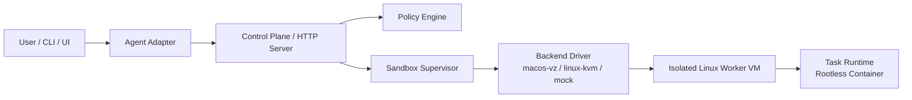

# Sandforge 🛠️

[](https://github.com/yanurag-dev/sandforge/blob/main/go.mod)
[](https://github.com/yanurag-dev/sandforge/actions/workflows/ci.yml)
[](https://github.com/yanurag-dev/sandforge/blob/main/LICENSE)
[](https://github.com/yanurag-dev/sandforge/issues)
[](https://github.com/yanurag-dev/sandforge/pulls)
[](ROADMAP.md)

**Sandforge** is a portable, secure, and robust sandbox architecture designed to run AI coding agents (such as Codex, Claude Code, and others) in a highly restricted, isolated environment. 

By enforcing the core principle of **"Control Plane Outside, Execution Inside"**, Sandforge protects your host machine from untrusted command execution, malicious third-party builds, and unsafe repository code.

---

## 🌟 Core Pillars

1. **Hypervisor-Level Isolation**: Strong virtual machine boundaries utilizing the **Apple Virtualization Framework** (`Virtualization.framework`) on macOS and **KVM** on Linux hosts.
2. **Per-Task Boundaries**: Rootless task containers inside the guest Linux worker to isolate individual agent commands.
3. **Deny-by-Default Policy**: Deep path validation (resolving symlinks to prevent escapes), restricted network execution modes (`offline`, `fetch`), and vCPU/RAM resource enforcement before compute begins.
4. **Clean Abstractions**: A swappable, interface-driven driver architecture (`SandboxBackend`) that enables mocking and platform parity without altering supervisor orchestration.

---

## 🏗️ Architecture Overview



### System Boundaries

*   **Host OS (Highly Trusted):** Runs the HTTP Control Plane Server, Policy Engine, and Sandbox Supervisor. None of the agent's code can touch these components directly.
*   **Virtual Machine (Low Trust):** Runs a minimal Linux guest standard. Receives commands via virtual socket (`VSOCK`) and interacts solely with explicitly mounted directories.

For a comprehensive architectural specification, read [ARCHITECTURE.md](ARCHITECTURE.md).

---

## 📂 Project Anatomy

```text
├── cmd/
│   └── sandforge/        # CLI Entry point & server bootstrapping
├── internal/
│   ├── adapter/          # Integrations for specific coding agents (Codex, Claude)
│   ├── backend/          # Hypervisor backends (macOS Apple VZ, Mock driver)
│   ├── controlplane/     # HTTP REST Server & API handlers (/v1/sandboxes)
│   ├── policy/           # Secure Policy Engine (Path whitelisting & limits)
│   └── supervisor/       # Thread-safe Lifecycle Supervisor & state machine
├── pkg/
│   └── api/              # Public interfaces & API structs (SandboxBackend)
├── scripts/              # Guest OS builder utilities
└── images/               # [Generated] Bootable kernels & initrd files
```

---

## 🗺️ Roadmap Status

We are actively progressing through **Phase 3**.

*   [x] **Phase 1: Foundation & Policy** — API definitions and the "Deny-by-Default" Policy Engine.
*   [x] **Phase 2: Orchestration & Mocking** — Thread-safe lifecycle state machine, RWMutex supervisors, and mock execution backends.
*   [✓] **Phase 3: macOS Execution Plane (`macos-vz`)** — Custom Linux guest image builder scripts, and Virtualization Framework integration.
    *   [x] Custom guest image packager (`scripts/build-images.sh`) fetching Alpine Linux + `linux-virt` kernels.
    *   [x] macOS VZ backend configuration (vCPUs, RAM, console channels, directory mounts, and VSOCK transport setup).
    *   [ ] Real-time command agent inside the guest VM (active frontier).
*   [ ] **Phase 4: Linux Execution Plane (`linux-kvm`)** — Native Linux hypervisor parity.
*   [ ] **Phase 5: Task Runtime** — Rootless container orchestration inside the worker.
*   [ ] **Phase 6: Control Plane & Adapters** — Secure credential brokers and LLM provider interfaces.
*   [ ] **Phase 7: CLI & Experience** — Real-time terminal output streaming and terminal adapters.

See [ROADMAP.md](ROADMAP.md) for granular task tracking.

---

## 🛠️ Getting Started

### Prerequisites

*   **Go**: Version `1.25` or higher.
*   **Host OS**: 
    *   macOS (Apple Silicon recommended for native hypervisor support)
    *   Linux (with KVM virtualization support)

---

### 1. Synchronize Dependencies

Ensure you have all module definitions and bindings fetched:

```bash
go mod tidy
```

### 2. Compile and Run Unit Tests

Sandforge features an extensive suite of concurrent tests, policy validations, and sandbox simulation flows:

```bash
go test -v ./...
```

### 3. Build the CLI

Compile the binary into a local path:

```bash
make build
```

---

### 4. Build Guest OS Images (macOS hosts)

If you are developing on a macOS host and wish to construct the lightweight bootable Linux guest environment, run the automatic image packager script. 

> [!NOTE]
> This requires `curl`, `cpio`, `gzip`, and `find` (all standard on macOS with Xcode Command Line Tools). It automatically fetches a minimal Alpine rootfs and extracts the optimized `linux-virt` hypervisor kernel.

```bash
# Build the guest VM image assets
make images
```

The script will generate these two files under the `images/` directory:
*   `images/vmlinuz` (Minimal Linux hypervisor kernel)
*   `images/initrd.img` (Minimal Alpine rootfs containing stubs for guest communication)

---

## 🤝 Contributing

We welcome collaborations and ideas! 

*   Since we are in early active development, please read through [ROADMAP.md](ROADMAP.md) to see active frontiers.
*   To propose significant architectural deviations, please open an Issue first so we can align on design principles.

---

## 📄 License

This project is licensed under the MIT License - see the [LICENSE](LICENSE) file for details.
