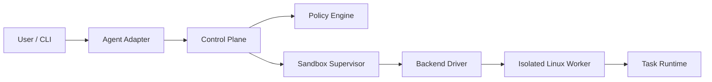

# Sandforge 🛠️

[](https://github.com/yanurag-dev/sandforge/blob/main/go.mod)
[](https://github.com/yanurag-dev/sandforge/actions/workflows/ci.yml)
[](https://github.com/yanurag-dev/sandforge/blob/main/LICENSE)
[](https://github.com/yanurag-dev/sandforge/issues)
[](https://github.com/yanurag-dev/sandforge/pulls)
[](ROADMAP.md)

**Sandforge** is a portable, secure sandbox architecture designed to run AI coding agents (like Codex, Claude Code, and others) in a restricted environment. It protects the host machine from generated commands, third-party tools, and untrusted repository code by enforcing a "Control Plane Outside, Execution Inside" principle.

## 🌟 Key Features

- **Host Isolation**: Uses Apple Virtualization Framework (macOS) and KVM (Linux) to create a strong VM boundary.
- **Task Isolation**: Per-task rootless containers inside the Linux worker guest.
- **Security First**: "Deny-by-Default" policy for filesystem, network, and resource access.
- **Agent Agnostic**: Provides a common tool contract for any LLM-based agent.
- **Performance**: Optimized for fast boot times and minimal resource overhead.

## 🏗️ Architecture



See [ARCHITECTURE.md](ARCHITECTURE.md) for the full technical design.

## 🗺️ Roadmap Status

We are currently at the end of **Phase 1**.

- [x] **Phase 1: Foundation & Policy** — Core security logic and "Deny-by-Default" engine.
- [ ] **Phase 2: Orchestration & Mocking** — Lifecycle management and state machine.
- [ ] **Phase 3: macOS Execution Plane (macos-vz)** — Real VM booting on Apple Silicon.
- [ ] **Phase 4: Linux Execution Plane (linux-kvm)** — Native Linux isolation.
- [ ] **Phase 5: Task Runtime** — Containerization inside the worker.

Full details in [ROADMAP.md](ROADMAP.md).

## 🛠️ Getting Started

### Prerequisites
- Go 1.25+
- macOS (Apple Silicon recommended) or Linux (KVM support)

### Development Commands
```bash
# Initialize dependencies
go mod tidy

# Run tests (Policy Engine)
go test -v ./internal/policy/...

# Build the CLI
go build -o sandforge ./cmd/sandforge
```

## 🤝 Contributing
Contributions are welcome! Please check the [ROADMAP.md](ROADMAP.md) for tasks in progress. Since we are in early development, please open an issue before starting major architectural changes.

## 📄 License
This project is licensed under the MIT License - see the [LICENSE](LICENSE) file for details (TODO: Add LICENSE file).
