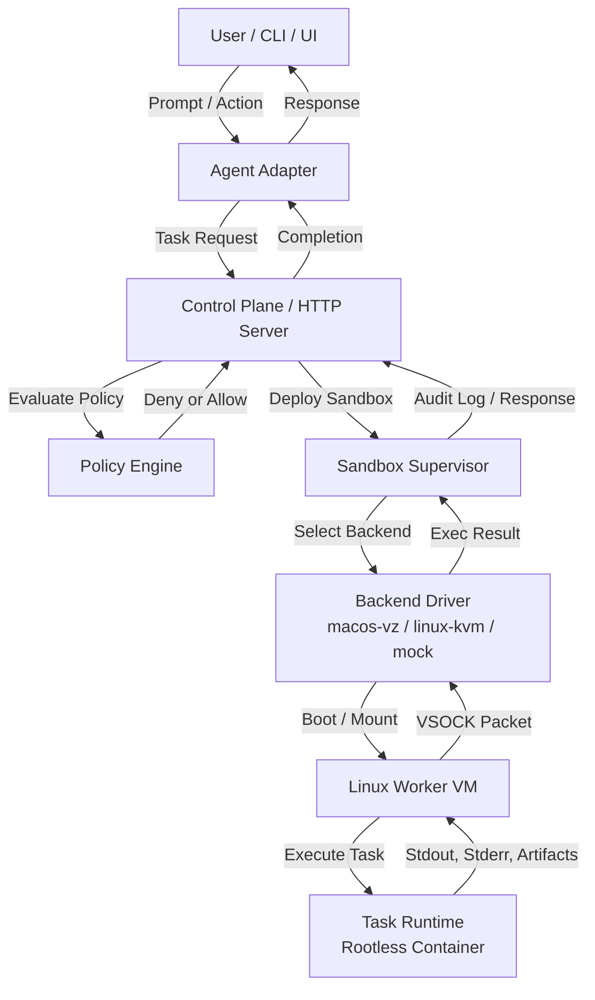
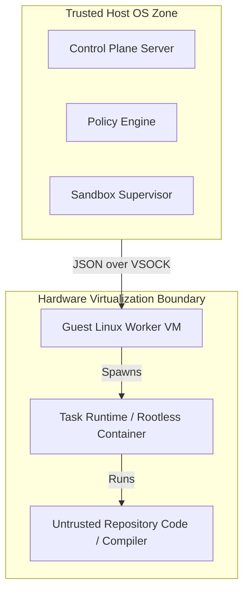

# System Architecture 🏗️

Sandforge utilizes a **"Control Plane Outside, Execution Inside"** architecture. This boundary ensures that the agent's brain (interacting with the LLM APIs, credentials, and user interface) remains highly secure on the host, while the agent's actions are dispatched into a locked-down hypervisor environment.

---

## 🗺️ High-Level Component Flow

The flow below represents how a user request progresses from the adapter down into the isolated execution plane and back:

---

## 🧩 Architectural Components

### 1. Agent Adapter (Host OS)
The Agent Adapter translates provider-specific models (such as OpenAI Codex, Claude Code, or local models) into standard Sandforge task requests. It parses tools, maps functions, and presents a uniform execution environment to the LLM.

### 2. Control Plane HTTP Server (Host OS)
Exposes the REST API (`/v1/sandboxes`) to orchestrate execution instances. It acts as the central coordinator, logging executions, managing session lifecycles, and persisting audit trails.

### 3. Policy Engine (Host OS)
The ultimate gatekeeper. It evaluates sandbox constraints (memory size, vCPUs), filesystem paths (whitelists/blocklists), and executable commands *prior* to hypervisor allocation.

### 4. Sandbox Supervisor (Host OS)
Coordinates backend instances using a thread-safe state machine. It prevents race conditions and ensures sandboxes transition cleanly through states: `requested` ➔ `provisioning` ➔ `ready` ➔ `executing` ➔ `destroying` ➔ `destroyed`.

### 5. Backend Driver (Host OS)
Platform-specific wrappers implementing the common `api.SandboxBackend` interface. On macOS, this driver boots the Apple Virtualization Framework; on Linux, it leverages KVM/Firecracker. A thread-safe Mock backend is provided for containerless host-side testing.

### 6. Isolated Worker (Guest VM)
A minimal, highly reproducible Linux OS image running inside the VM. It includes a custom `/init` script, holds no sensitive host credentials, and serves strictly to execute tasks.

### 7. Task Runtime (Guest VM)
Provides containerized isolation inside the guest OS. Commands are executed inside rootless, unprivileged containers to provide per-command isolation.

---

## 🔒 Trust Boundaries

Sandforge divides operations into explicit trust levels to prevent sandbox escapes:

### Trusted Host OS Zone
*   **Access:** Direct access to host files, environment variables, network credentials, SSH keys, and LLM APIs.
*   **Security Principle:** The coding agent's LLM tokens and API keys *never* enter the VM.

### Untrusted Guest VM Zone
*   **Access:** Restricted solely to directories explicitly mounted by the supervisor. Network is disabled (`offline`) or limited to package registries (`fetch`).
*   **Security Principle:** Even if code acquires root privileges inside the guest VM, it is locked inside a minimal Linux kernel boundary, unable to read host system APIs or access the macOS desktop environment.
