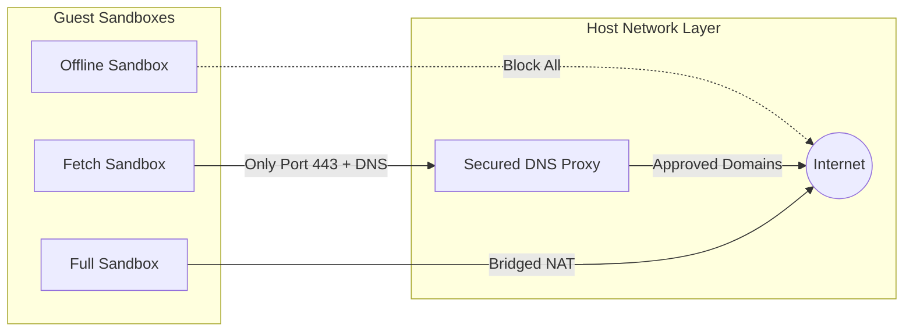

# Advanced Guides ⚙️

This guide covers advanced configurations for high-volume, production-ready deployments of Sandforge.

---

## 🌐 1. MicroVM Network Configuration

Sandforge offers three isolated network tiers to control guest access to external networks.



### Network Modes Configuration Details

1. **`offline` (Default / Highly Recommended):**
   * **Behavior:** Loopback adapter (`127.0.0.1`) only. All outgoing IP traffic is dropped at the hypervisor virtual switch level.
   * **Use Case:** Executing code scripts, running test suites, parsing local repositories.

2. **`fetch`:**
   * **Behavior:** Outgoing TCP requests are allowed *strictly* on Port `443` and Port `53` (DNS). Sandforge runs a local host DNS proxy resolving allowed domain patterns only (e.g. `*.github.com`, `*.npmjs.org`).
   * **Use Case:** Installing project dependencies or resolving git repositories while blocking scraping or unauthorized telemetry.

3. **`full`:**
   * **Behavior:** Standard bridged NAT network, granting complete external IP access.
   * **Use Case:** Running scraping workflows or web agent setups where unrestricted network access is necessary.

---

## ⚡ 2. Caching Toolchains for Hyper-Speed Boots

By default, launching clean microVMs means compilers must redownload dependencies or recompile caching layers from scratch on every run. You can configure **Cache Mounts** to persist toolchain data between tasks without polluting the core VM image.

### Caching npm Modules

Mount a shared host directory to the guest npm cache directory:

```bash
./sandforge run \
  --dir=. \
  --mount="host_path=/Users/anurag/.npm-cache,guest_path=/root/.npm,read_only=false" \
  "npm install"
```

### Caching Go Build Artefacts

Mount host directories for `GOCACHE` and `GOPATH` to prevent Go from recompiling standard libraries on every execution:

```bash
./sandforge run \
  -d . \
  --mount="host_path=/Users/anurag/Library/Caches/go-build,guest_path=/root/.cache/go-build,read_only=false" \
  --mount="host_path=/Users/anurag/go/pkg/mod,guest_path=/go/pkg/mod,read_only=false" \
  "go test ./..."
```

---

## 🛠️ 3. Building a Custom Guest Linux RootFS

If your coding agents require custom system binaries (e.g. `sqlite3`, `graphviz`, or specific LLVM compilers), compile a custom guest image.

### Prerequisite Dependencies
Install standard compression utilities on your host:
```bash
sudo apt-get install cpio gzip
```

### Customization Script (`build_rootfs.sh`)
Use this bash script to unpack the base Sandforge image, inject custom binary packages, and repackage the guest:

```bash
#!/usr/bin/env bash
set -euo pipefail

# 1. Create working directory
WORKDIR=$(mktemp -d)
cd "$WORKDIR"

# 2. Extract base guest RAM disk
gzip -cd ~/.config/sandforge/images/initrd-guest-latest.img | cpio -idmv

# 3. Inject pre-compiled packages (e.g. custom sqlite3 binary)
mkdir -p usr/bin
curl -o usr/bin/sqlite3 https://sandforge.dev/binaries/sqlite3-x86_64
chmod +x usr/bin/sqlite3

# 4. Pack and re-compress cpio archive
find . -print0 | cpio --null -ov --format=newc | gzip -9 > ~/.config/sandforge/images/initrd-guest-custom.img

echo "Successfully built and registered custom guest rootfs."
```
