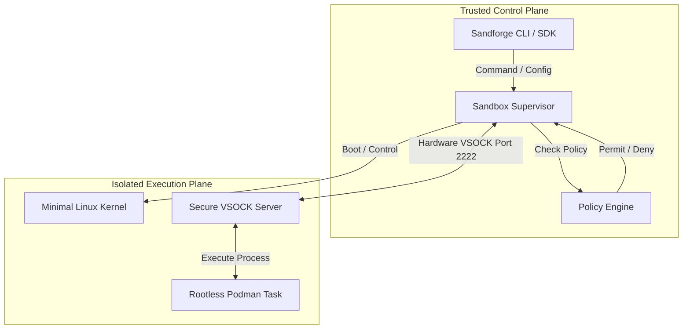

# Introduction 🛠️

**Sandforge** is a portable, secure, and robust sandbox architecture designed to run autonomous AI coding agents (such as Codex, Claude Code, and custom LLM developer tools) in a highly restricted, isolated environment.

By enforcing the core security principle of **"Control Plane Outside, Execution Inside"**, Sandforge ensures that generated commands, third-party build packages, and untrusted repository code do not compromise the host machine.

---

## 🌟 Core Pillars

1. **Hypervisor-Level Isolation**: Strong virtual machine boundaries utilizing Apple's **Virtualization Framework** (`Virtualization.framework`) on macOS 12+ and **KVM** on Linux hosts.
2. **Per-Task Boundaries**: Rootless task containerization inside the guest Linux worker to isolate individual agent operations and prevent host network access.
3. **Deny-by-Default Policy**: Deep path validation (resolving symlinks to prevent directory escapes), strict network configuration modes (`offline`, `fetch`), and resource constraint enforcement.
4. **Clean Abstractions**: A swappable, interface-driven driver architecture (`SandboxBackend`) that enables mocking and cross-platform parity without altering core supervisor code.

---

## 🆚 Comparison to Alternatives

When running autonomous coding agents that write and execute arbitrary terminal commands, standard container setups are often insufficient or insecure. Here is how Sandforge compares to traditional approaches:

| Approach | Isolation Level | Docker Daemon Access | Target Use Case |
| :--- | :--- | :--- | :--- |
| **Sandboxes (microVMs / Sandforge)** | **Full (hypervisor-level)** | **Isolated inside VM** | **Autonomous AI Agents (Untrusted code)** |
| Container with socket mount | Partial (namespaces) | Shared host daemon (Dangerous!) | Trusted local developer tools |
| Docker-in-Docker | Partial (privileged) | Nested daemon (Heavy & complex) | CI/CD pipelines and runners |
| Host execution | None | Host daemon | Manual, local software development |

---

## ⚡ The Sandforge Advantage

> [!IMPORTANT]
> **Why Choose Sandforge?**
> Standard VM hypervisors are slow to boot and consume vast quantities of system memory. Sandforge is custom-tailored for agent lifecycles, optimizing kernel initialization and memory maps to achieve sub-second boots.

* **Virtual Socket Communication:** Instead of relying on insecure guest HTTP or SSH bridges, Sandforge uses raw, hardware-level Virtual Sockets (`VSOCK`) over port `2222` to send and receive execution payloads.
* **Proactive Policy Inspection:** The host-side Policy Engine inspects operations *before* hypervisor compute resources are spun up, conserving CPU cycles and memory.
* **Stateless and Ephemeral:** Sandboxes are designed for micro-lifecycles. Once the coding agent finishes executing a task, the VM guest memory state is purged instantly.
