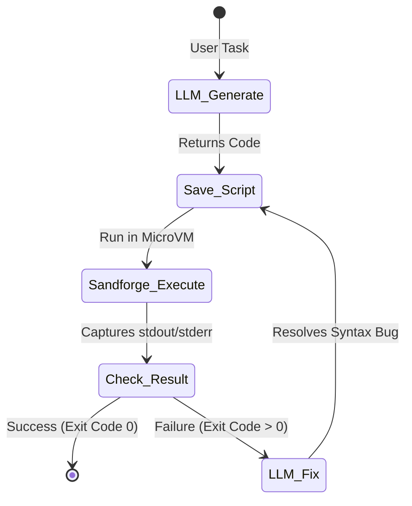

# Coding Agent Tutorial 🤖

This tutorial guides you through building a complete, autonomous LLM coding agent that can write python scripts, execute them inside Sandforge, inspect stdout/stderr outcomes, and recursively fix syntax bugs.

---

## 🏗️ The Agent Loop Concept

Standard coding agents often fail because they lack immediate feedback. By integrating Sandforge, the agent can test the code it generates:



---

## 🐍 Python Implementation

This complete Python script implements our agent loop, using the OpenAI API to write code and the Sandforge REST API to run the script inside a secure hypervisor sandbox.

### Prerequisites
Install the required packages:
```bash
pip install openai requests
```

### Complete Code (`agent.py`)

```python
import os
import time
import requests
from openai import OpenAI

# Initialize client SDKs
client = OpenAI(api_key=os.environ.get("OPENAI_API_KEY"))
SANDFORGE_API = "http://localhost:8585/v1"
HEADERS = {"Authorization": "Bearer sf_live_token"}

# The goal for the agent
TASK_PROMPT = """
Write a python function that calculates the nth Fibonacci number, 
and prints fibonacci(10) to the console.
"""

def generate_code(prompt, error_log=None):
    """Ask LLM to generate or fix python code."""
    system_prompt = "You are a senior python developer. Output ONLY runnable python code. Do not include markdown code block syntax."
    
    user_content = prompt
    if error_log:
        user_content += f"\n\nYour previous code failed with the following error:\n{error_log}\n\nPlease fix the bug and return the corrected script."

    response = client.chat.completions.create(
        model="gpt-4o",
        messages=[
            {"role": "system", "content": system_prompt},
            {"role": "user", "content": user_content}
        ],
        temperature=0.2
    )
    return response.choices[0].message.content.strip()

def run_in_sandbox(script_content):
    """Launch hypervisor sandbox and execute python script."""
    
    # 1. Create a transient sandbox
    create_res = requests.post(
        f"{SANDFORGE_API}/sandboxes",
        headers=HEADERS,
        json={"cpu": 1, "memory_mb": 1024, "network": "offline"}
    )
    if create_res.status_code != 200:
        raise Exception(f"Failed to create sandbox: {create_res.text}")
    
    sandbox_id = create_res.json()["id"]
    
    try:
        # Wait briefly for VM boot-up (approx. 200ms)
        time.sleep(0.3)
        
        # 2. Write code file and execute it in guest VM
        # Escape command details
        escaped_script = script_content.replace('"', '\\"')
        command = f'echo "{escaped_script}" > script.py && python3 script.py'
        
        exec_res = requests.post(
            f"{SANDFORGE_API}/sandboxes/{sandbox_id}/execute",
            headers=HEADERS,
            json={"command": command, "timeout_seconds": 15}
        )
        return exec_res.json()
        
    finally:
        # 3. Always delete sandbox and reclaim memory
        requests.delete(f"{SANDFORGE_API}/sandboxes/{sandbox_id}", headers=HEADERS)

# --- Active Execution Agent Loop ---
def run_agent():
    print("🚀 Initializing Autonomous Agent Loop...")
    code = generate_code(TASK_PROMPT)
    
    attempts = 3
    for attempt in range(1, attempts + 1):
        print(f"\n[Attempt {attempt}/{attempts}] Executing script inside secure microVM...")
        print("--- Generated Code Preview ---")
        print(code)
        print("------------------------------")
        
        # Run inside VM sandbox
        result = run_in_sandbox(code)
        
        if result["exit_code"] == 0:
            print("✅ Execution Succeeded!")
            print("--- Output ---")
            print(result["stdout"])
            break
        else:
            print(f"❌ Execution Failed with Exit Code {result['exit_code']}!")
            print("--- Error Log ---")
            print(result["stderr"])
            
            if attempt == attempts:
                print("\nReached max execution attempts. Agent failed.")
                break
            
            # Recursive feedback: feed error back to LLM to correct it
            print("Re-submitting error stack to LLM for debugging...")
            code = generate_code(TASK_PROMPT, error_log=result["stderr"])

if __name__ == "__main__":
    run_agent()
```
